# Movimiento - Físicas: 
* author: Saúl Sosa Díaz
* email: _alu0101404141@ull.edu.es_

# Ejercicio 1:
Agrega un campo velocidad al cubo de la práctica anterior y asígnale un valor que se pueda cambiar en el inspector de objetos. Muestra la consola el resultado de multiplicar la velocidad por el valor del eje vertical y por el valor del eje horizontal cada vez que se pulsan las teclas flecha arriba-abajo ó flecha izquierda-derecha. El mensaje debe comenzar por el nombre de la flecha pulsada.  

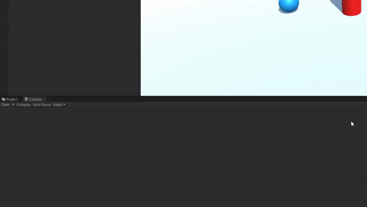

# Ejercicio 2:
Mapea la tecla H a la función disparo.

# Ejercicio 3:
Crea un script asociado al cubo que en cada iteración traslade al cubo una cantidad proporcional un vector que indica la dirección del movimiento: moveDirection que debe poder modificarse en el inspector.  La velocidad a la que se produce el movimiento también se especifica en el inspector, con la propiedad speed. Inicialmente la velocidad debe ser mayor que 1 y el cubo estar en una posición y=0. En el informe de la práctica comenta los resultados que obtienes en cada una de las siguientes situaciones

* a) Duplicas las coordenadas de la dirección del movimiento. 
    No sucede nada ya que lo que nos interesa es la dirección del vector y para ello lo normalizamos.
* b) Duplicas la velocidad manteniendo la dirección del movimiento.
    Desaparece más rápido.
* c) La velocidad que usas es menor que 1.
    No desaparece instantáneamente.
* d) La posición del cubo tiene y>0.  
    El cubo se eleva.
* e) Intercambiar movimiento relativo al sistema de referencia local y el mundial.
    No detecto ninguna diferencia.

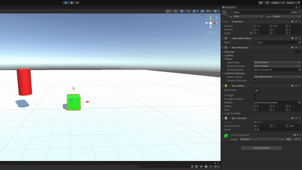

# Ejercicio 4:
Mueve el cubo con las teclas de flecha arriba-abajo, izquierda-derecha a la velocidad speed. Cada uno de estos ejes implican desplazamientos en el eje vertical y horizontal respectivamente. Mueve la esfera con las teclas w-s (movimiento vertical) a-d (movimiento horizontal).  

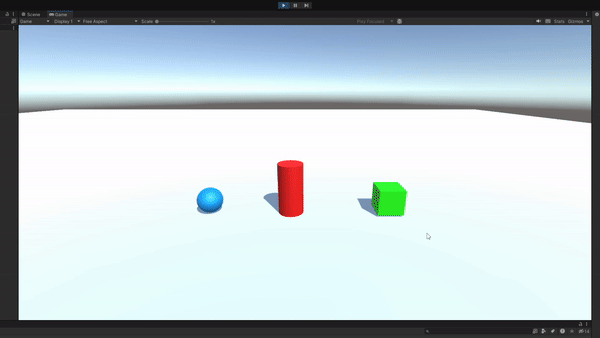

# Ejercicio 5:
Adapta el movimiento en el ejercicio 4 para que sea proporcional al tiempo transcurrido durante la generación del frame.  

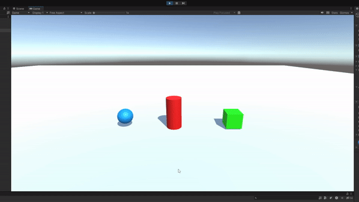

# Ejercicio 6:
Adapta el movimiento en el ejercicio 5 para que el cubo se mueva hacia la posición de la esfera. Debes considerar, que el avance no debe estar influenciado por cuánto de lejos o cerca estén los dos objetos.   

# Ejercicio 7:
Adapta el movimiento en el ejercicio 6 de forma que el cubo gire hacia la esfera. Realiza pruebas cambiando la posición de la esfera mediante las teclas awsd

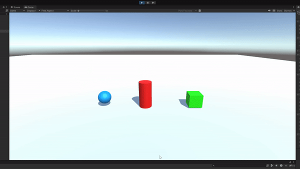

# Ejercicio 8:
Utilizar el eje “Horizontal” para girar el objetivo y que avance siempre en la dirección hacia adelante.

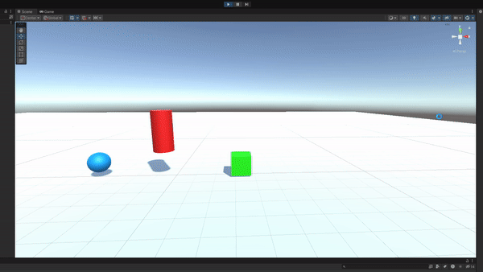

# Ejercicio 9:
Configura el cilindro como un objeto físico, cuando el cubo o la esfera colisionen con él se debe mostrar un mensaje en consola con la etiqueta del objeto que haya colisionado. 

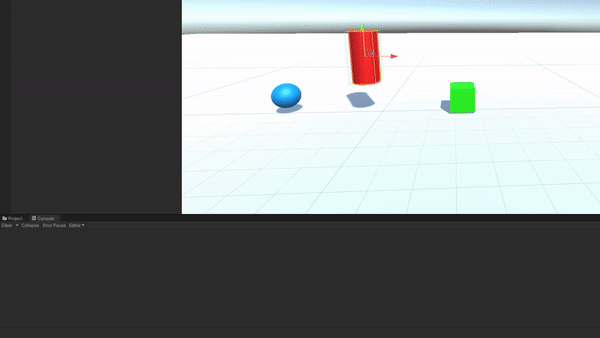

# Ejercicio 10:
Configura el cubo como un objeto cinemático y la esfera como un objeto físico. Adapta los scripts del ejercicio 9 para obtener el mismo comportamiento. 

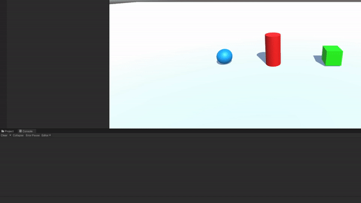

# Ejercicio 11:
Configura el cilindro como un objeto de tipo Trigger. Adapta los scripts de los ejercicios anteriores para obtener el mismo comportamiento.

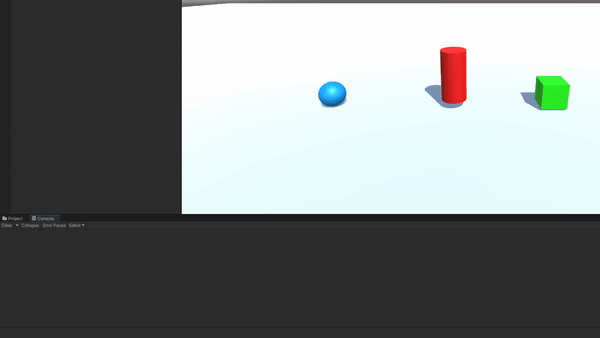

# Ejercicio 12:
Agrega un cilindro de un color diferente al que ya hay en la escena y configúralo como un objeto físico. Selecciona un conjunto de teclas que te permitan controlar su movimiento por la escena y prográmale un movimiento que permita dirigirlo hacia la esfera.  física con masa 10 veces menor que el cilindro, cinemática y trigger. También prueba la configuración del cilindro de forma que su fricción se duplique o no. Explica en el informe todos los resultados posibles. 
 * a) Esfera física con masa 10 veces mayor que el cilindro.  
 

 * b) Con masa 10 veces menor que el cilindro.  

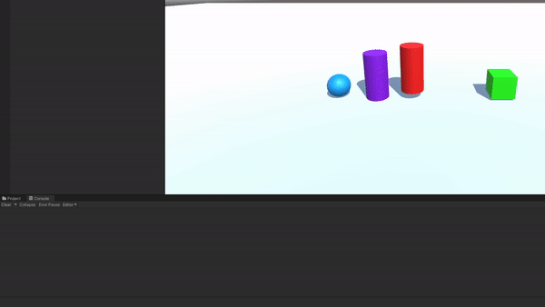

 * c) Cinemática.  

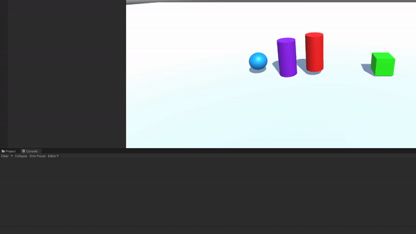
  
 * d) Trigger.  

  

 * e) Fricción.
La fricción no cambia porque estoy usando MovePosition y no AddForce.