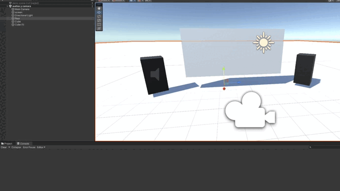

# Micrófono y cámara: 
* author: Saúl Sosa Díaz
* email: _alu0101404141@ull.edu.es_

# Ejercicio 1:
Cuando el zombie toque la araña, suene un sonido. He subido a youtube los videos para que se pueda oir. El script correspondiente al ejercicio es audio.cs.  
[Enlace al video](https://youtu.be/rJAvB4rfpoc?si=rHmx-fmvo3XWm2jE)

# Ejercicio 2:
Ahora captaremos el audio por el micrófono y luego lo reproduciremos en unity, además se muestra en la consola todos los dispositivos disponibles. 
Se puede parar también la captación del mocrófono.
El script correspondiente a este ejerciocio es Recorder.cs
Adjunto también el enlace al video del ejercicio 2. 
[Enlace al video](https://youtu.be/EVSZXgZHLd4)

# Ejercicio Cámaras
Ahora captaremos la cámara y luego la mostraremos en unity cuando se pulse la tecla _s_. Además se muestra en la consola todos los dispositivos disponibles.
Cuando la cámara está activa se puede guardar una captura de pantalla al presionar la tecla _x_. Si quisieramos terminar la captura de video podríamos darle a la tecla _p_. 
El script correspondiente a este ejerciocio es TV.cs
En el siguiente gif se observa todas las funcionalidades mencionadas anteriormente.  
