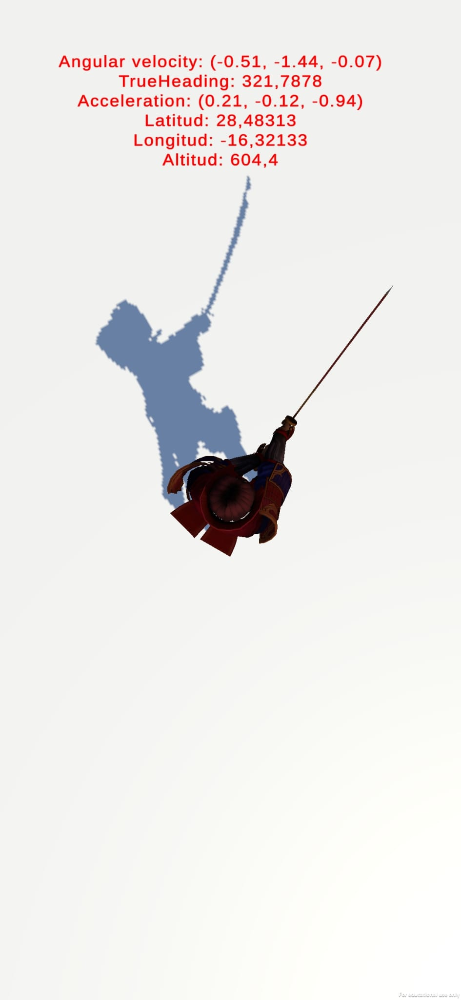
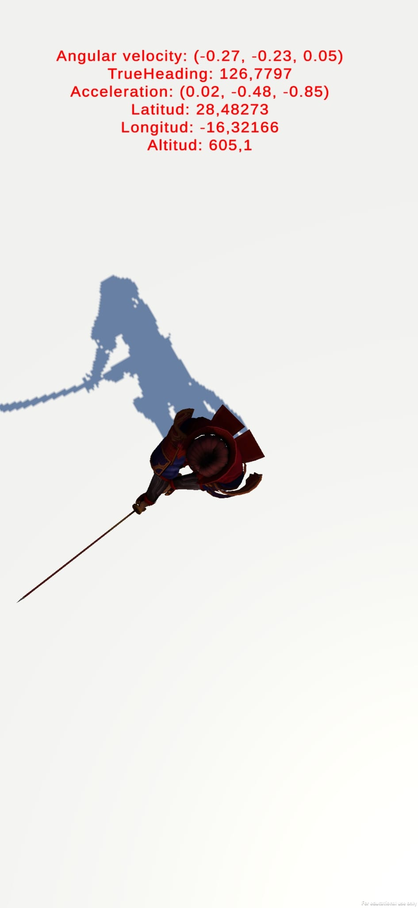
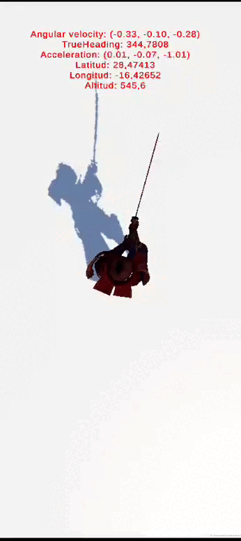

# Sensores: 
* author: Saúl Sosa Díaz
* email: _alu0101404141@ull.edu.es_

# Ejercicio 1:
Se adjuntan las imágenes capturadas dentro del centro de cálculo y en la puerta de la facultad.

**Dentro del dentro de cálculo.**
  

**En la puerta de la facultad.**
  

Vemos que las coordenadas de latitud y longitud difieren en las dos imágenes.
* Dentro del centro de cálculo nos da la medición de lat=28.48313 y lon=-16.32133
* En la puerta de la facultad, lat=28.48273 y lon=-16.32166
# Ejercicio 2:
El samurai siempre apuntará con su espada al norte independientemente de como se mueva el móvil. 
  
El script correspondiente a este es¡jercicio es *sensores.cs*
